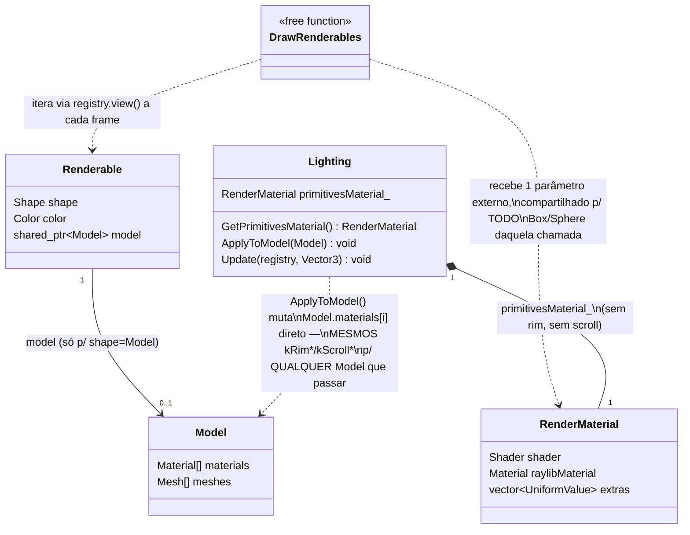
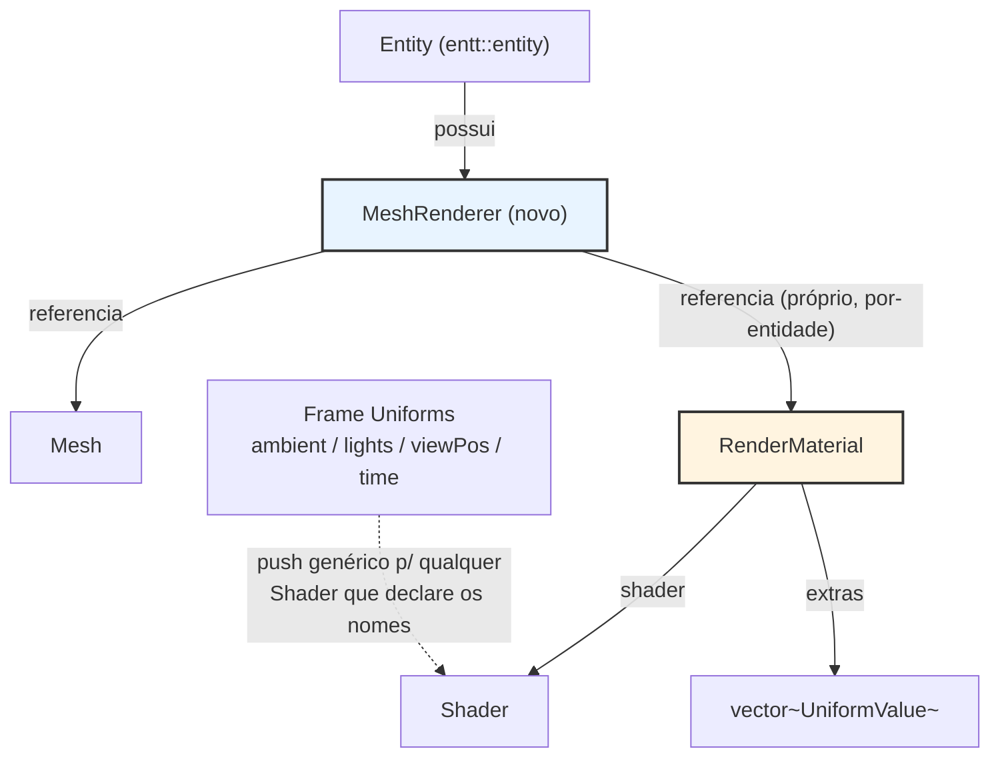
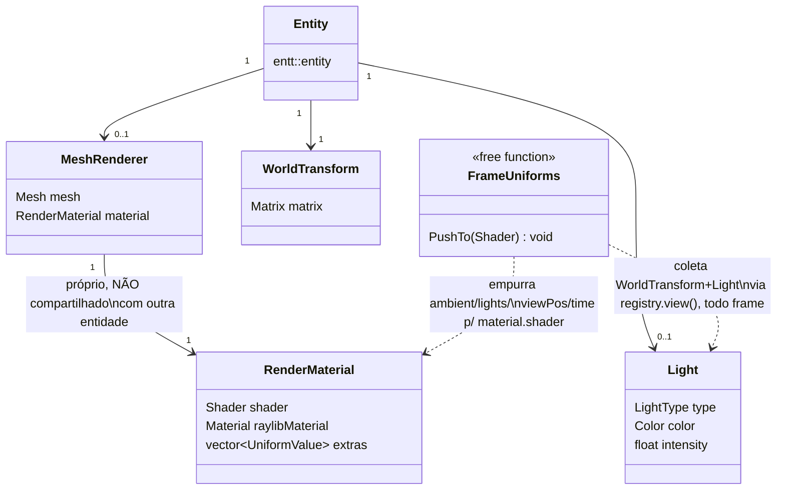
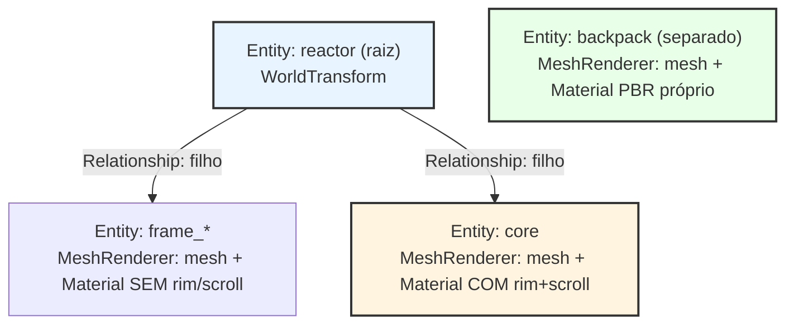

# 20. MeshRenderer/Material/Shader: separar "o quê" de "como" de "código GPU"

- Status: Proposed — **deliberadamente em aberto**, não é uma decisão fechada. Registrado agora pra
  não perder o desenho da conversa; revisitar antes de qualquer implementação real (ver `##
  Continuar depois` no fim).
- Date: 2026-08-10

## Por que este ADR existe

Nasceu de dois problemas reais, encontrados implementando o efeito de scroll (`docs/learning/
rendering.html`, efeito 2, em cima da camada da [ADR-0019](0019-render-material-layer.md)):

1. **"Cubo e esfera não conseguem ter efeitos diferentes hoje."** `DrawRenderables(registry,
   material)` (`app/scene/renderable.h`) recebe **um** `RenderMaterial` aplicado a todo Box/Sphere
   sólido daquela chamada — o Sentinel e qualquer outro primitivo sólido futuro sempre compartilham
   a mesma instância. Não existe conceito de "esse `Renderable` usa esse material especificamente".
2. **"O efeito aplicou no reator inteiro, não só onde eu esperava."** `Lighting::ApplyToModel`
   aplica rim + scroll aos 12 materiais do reator igualmente — não existe "esse material é o núcleo,
   os outros não são". Combinado com uma intensidade alta, isso estourou o modelo inteiro pra
   quase-branco (visto num screenshot real do usuário, não hipotético).

O usuário trouxe uma proposta de arquitetura inspirada em engines modernas (Unity) e no `Three.js`:

```
GameObject → MeshRenderer → Material → Shader → GPU Program
```

com Shader = código GLSL reutilizável, Material = configuração concreta de um Shader (parâmetros +
texturas), MeshRenderer = a ponte Mesh+Material por-objeto, variantes de shader via features
(`HAS_NORMAL_MAP`, `HAS_SHADOWS`, ...), uniforms escopados em Frame/Material/Object, e uma
organização de assets (`assets/shaders/<categoria>/`, `assets/materials/*.mat`) com `ShaderManager`/
`MaterialManager` como recursos compartilháveis. Texto completo da proposta na conversa que motivou
este ADR (2026-08-10) -- resumido fielmente na seção `## Proposta do usuário` abaixo.

## Contexto: o que já existe hoje

- **Material → Shader já existe.** [ADR-0019](0019-render-material-layer.md)'s `RenderMaterial
  { Shader shader; ::Material raylibMaterial; std::vector<UniformValue> extras; }`
  (`app/scene/material.h`) é exatamente o "Material é uma configuração concreta de um Shader" da
  proposta -- não é trabalho novo, já está construído e em produção (reator + sandbox).
- **`Renderable`/`BoxRenderable` não têm Material próprio.** `Renderable` (`app/scene/renderable.h`)
  carrega shape/size/color/wireframe -- aparência inline, sem referência a um `RenderMaterial`. Quem
  decide o material é o *chamador* de `DrawRenderables`, não a entidade. Isso é o equivalente a não
  existir `MeshRenderer` ainda.
- **Uniforms já são escopados em Frame/Material/Object, só que informalmente.** `Lighting::Update`
  empurra `ambient`/`lights[]`/`viewPos`/`time` (Frame) pras instâncias que o próprio `Lighting`
  compilou; `RenderMaterial::extras` já é o nível Material; a `Matrix transform` passada pra
  `DrawWithMaterial` já é o nível Object. Não existe um contrato nomeado/genérico -- um shader novo
  que quisesse luz teria que reimplementar o push à mão.
- **`ResourceCache<Shader>` existe e tem zero chamadores reais.** `Engine::GetShader()`
  (`engine.h:102`) está pronto, mas `game/flare_reactor` deliberadamente não o usa: raylib's
  `UnloadModel → UnloadMaterial` dá `UnloadShader` sem refcount (documentado no header de
  `lighting.h`) -- compartilhar uma única instância de `Shader` entre os 12 materiais do reator
  causaria double-free do mesmo programa GL no primeiro `UnloadModel`. Por isso o reator hoje compila
  12 instâncias independentes, uma por material, cada uma "dona" do seu próprio programa GL.
- **Textura num Material desenhado via `DrawMesh` só é re-vinculada automaticamente se estiver em
  `Material.maps[]`** (raylib, `rmodels.c`) -- descoberto ao vivo nesta mesma sessão implementando o
  efeito de scroll (`SetShaderValueTexture` numa uniform arbitrária não funciona pra esse caminho de
  desenho). Qualquer sistema de Material que preveja texturas customizadas (normal map, environment
  map, o que a proposta chama de features) precisa nascer sabendo dessa restrição.

## Diagrama: classes e relações hoje



O que esse desenho já deixa visível: `Renderable` **não tem seta pra `RenderMaterial`** — a única
relação com material vem de fora (`DrawRenderables`' parâmetro, ou `Lighting::ApplyToModel` mutando
o `Model` direto). Não existe hoje uma classe que amarre "essa entidade" a "esse material
especificamente" — esse é o buraco que o `MeshRenderer` da proposta preenche.

**Risco concreto novo, confirmado testando com um segundo model real** (`survival_guitar_backpack`,
PBR de verdade: baseColor + metallicRoughness + normal map): `raylib.h` define
`#define MATERIAL_MAP_SPECULAR MATERIAL_MAP_METALNESS` — **é o mesmo slot** (índice 1). O fix do bug
de ontem colocou a textura do scroll do reator exatamente nesse slot
(`model.materials[i].maps[MATERIAL_MAP_SPECULAR].texture = *energyTexture_`, `lighting.cpp`). O
loader de glTF do raylib usa esse mesmo slot pra carregar o canal metalness de qualquer model real
(`rmodels.c:5579`). Ou seja: `Lighting::ApplyToModel(backpackModel)` hoje **sobrescreveria a
metalness real do backpack pela textura de ruído do reator** — não é "falta de flexibilidade", é
corrupção de dado ativa, e é exatamente o tipo de colisão que `Lighting` sendo global/monolítico
(uma instância, mesmos extras, para qualquer `Model`) garante que vai acontecer de novo.

## Diagrama: proposta (Fase A)



Cada `Entity` (reator, backpack, Sentinel, o que vier) carrega seu **próprio** `RenderMaterial` via
`MeshRenderer` — reator pode ter rim+scroll, backpack pode não ter nenhum dos dois (ou ter um efeito
diferente), sem colisão de slot nem efeito vazando de um pro outro. `Frame Uniforms` continua
genérico e independente de qual `Shader` está montado — resolve a parte "todo shader lighting-aware
recebe ambient/lights/viewPos/time sem reimplementar o push".

## Proposta do usuário (resumo fiel)

- **Separação de responsabilidade**: `GameObject` não conhece shader; só sabe que tem um
  `MeshRenderer`. `MeshRenderer` sabe que existe um `Material` (não sabe GLSL/PBR/lighting/shadow).
  `Material` sabe quais parâmetros usar num `Shader`. `Shader` sabe como executar o rendering.
  `RenderSystem` sabe como transformar tudo isso em comandos pra GPU.
- **Shader é código reutilizável**, potencialmente compartilhado por muitos materiais (`PBRShader`
  usado por `CarPaintMaterial` e `AsphaltMaterial` ao mesmo tempo, cada um com seus próprios
  parâmetros).
- **Materiais de alto nível prontos** (`PBRMaterial`, `UnlitMaterial`, `ParticleMaterial`,
  `ToonMaterial`) + **`CustomMaterial`** pra shaders escritos à mão (equivalente ao `ShaderMaterial`
  do Three.js).
- **Shader variants/features**: em vez de um arquivo GLSL por combinação, um shader base com
  features que o Material liga/desliga (`HAS_NORMAL_MAP`, `HAS_EMISSION`, `HAS_ENVIRONMENT_MAP`,
  `HAS_SHADOWS`, `HAS_SKINNING`, `HAS_VERTEX_COLORS`); o sistema resolve/gera a variante certa.
  Implementação concreta aberta -- "o importante é que a arquitetura não force um shader
  independente por material".
- **Uniforms em três escopos**: Global/Frame (câmera, matrizes, tempo, tamanho de tela, luzes),
  Material (baseColor, metallic, roughness, texturas, emission), Object (matriz de modelo, id,
  dados específicos) -- evitando reenviar dados globais objeto a objeto.
- **Recursos compartilháveis**: `ShaderManager`/`MaterialManager` carregam por nome; um mesmo
  `Shader` existe uma vez em memória/GPU quando possível; `Material`s são instâncias/configurações
  diferentes sobre o mesmo `Shader`.
- **Organização de assets** proposta:
  ```
  assets/
    shaders/{common,pbr,unlit,particles,custom}/...
    materials/*.mat
    textures/...
    meshes/...
  ```
  com `.mat` como YAML-like (`shader: "pbr"`, `textures: {...}`, `properties: {...}`).
- **`MeshRenderer` simples**: `{ Mesh* mesh; Material* material; }`, sem conhecer GLSL/PBR/shadow.
- **Pipeline conceitual**: `RenderSystem` → visibilidade → sort/batch → resolve Material → resolve
  Shader Variant → bind global → bind material → bind object → draw Mesh.
- **Objetivo declarado**: evoluir de `GameObject→MeshRenderer→Material→Shader` (simples) pra
  `GameObject→MeshRenderer→Material→Shader Variant→GPU Program` (mais sofisticado) depois, **sem
  quebrar a API dos GameObjects**.

## Três referências, convergindo

Depois da proposta original, olhamos duas referências reais junto com o usuário: a página
["Fundamentals" do manual do Three.js](https://threejs.org/manual/en/fundamentals.html) e o
capítulo ["Model Loading" do LearnOpenGL](https://learnopengl.com/Model-Loading/Mesh) (+ a classe
`Shader` de [Getting-started/Shaders](https://learnopengl.com/Getting-started/Shaders)). As duas
resolvem o mesmo problema de formas diferentes -- útil justamente por discordarem num ponto:

| Conceito | Three.js | LearnOpenGL | Proposta original | frame-3 hoje | frame-3 proposto (Fase A) |
|---|---|---|---|---|---|
| "Coisa desenhável" | `Mesh` (extends `Object3D`) | `Mesh` (dados + VAO/VBO/EBO) | `MeshRenderer` | `Renderable` (sem material próprio) | `MeshRenderer` novo: Mesh + `RenderMaterial` por-entidade |
| Config de shading | `Material`, objeto próprio, **compartilhável entre Meshes** | **Não existe** -- textura+nome-convenção dentro do próprio `Mesh` | `Material` | `RenderMaterial` (ADR-0019) | mantém `RenderMaterial`, agora referenciado pelo `MeshRenderer` |
| Código GPU | `Shader`/programa interno | classe `Shader` (compile/link/`setFloat`/`setInt`) | `Shader` + variantes | `Shader` do raylib + `ApplyExtras` | igual; variantes ficam pra Fase B |
| Luz | `Light` -- é um `Object3D`, **addable, com posição**, entra na scene como qualquer objeto | fora do escopo do tutorial | uniform de Frame | `kLights[2]` hardcoded, privado em `lighting.cpp` | `Light` **component** novo, em qualquer entidade com `WorldTransform` |
| Malha multi-parte | `Group`/hierarquia de `Object3D` (ex.: rodas filhas do carro) | `Model` = `vector<Mesh>` + cache de textura | não detalhado | `Model` do raylib -- 1 struct, N materiais internos, tratados uniformemente | subtree de **entidades filhas via `Relationship`** (ADR-0002, já existe), 1 `MeshRenderer` por submesh |
| Cache de textura | interno ao renderer | `textures_loaded` dentro do `Model`, evita recarregar a mesma textura pra GPU | `MaterialManager` | `ResourceCache<Texture2D>` (`Engine::Textures()`) | mantém -- já resolvido, nada novo |

**O ponto de discordância real** entre as duas referências: o Three.js separa Mesh/Material como
objetos independentes e compartilháveis; o LearnOpenGL nem tem uma classe `Material` -- o `Shader`
entra por parâmetro em `Mesh::Draw(shader)`, e a textura se liga por convenção de nome
(`texture_diffuse1`, `texture_specular2`, contador por tipo). **O que já temos hoje
(`DrawWithMaterial(mesh, material, transform)`, `app/scene/renderer.h`) já é mais parecido com o
formato do LearnOpenGL** (função livre, não método de uma classe `Mesh`) **do que com o do
Three.js** -- e isso é bom: bate com o estilo já estabelecido no projeto (funções livres sobre
classes quando não precisa de estado, ex. `DrawRenderables`/`DrawBoxRenderables`). Não precisa virar
uma classe `Mesh`/`Renderer` só porque o Three.js é assim.

**A sacada que resolve dois riscos de uma vez, usando infraestrutura que já existe**: um `Model`
multi-material (reator, 12 materiais) não precisa de mecanismo novo nenhum pra "cada parte ter seu
próprio material" -- vira uma **subtree de entidades filhas**, usando a hierarquia que a
[ADR-0002](0002-scene-graph-hierarchy-options.md) já construiu (`Relationship`/`LocalTransform`/
`WorldTransform`/`PropagateTransforms`), exatamente como o `Group`/hierarquia de `Object3D` do
Three.js faz pras rodas de um carro. Cada submesh vira uma entidade com seu próprio `MeshRenderer`
(logo, seu próprio `RenderMaterial`/`Shader`) -- o núcleo do reator pode ter rim+scroll, o resto do
frame não, e o backpack (entidade totalmente separada, shader totalmente separado) nunca compartilha
estado com nenhum dos dois. Resolve o risco #2 (efeito vazando pro modelo inteiro) **e** o risco #4
(colisão de slot com o backpack) ao mesmo tempo, sem inventar mecanismo novo -- só aplicando
`MeshRenderer` + a hierarquia que já existe.

## Diagrama: proposta convergida (Fase A)



Contraste direto com o diagrama "hoje" acima: `MeshRenderer` faz a seta que faltava
(`Entity → RenderMaterial`, própria, não emprestada de fora), e `Light` sai de constante privada
pra componente de verdade, coletado a cada frame como qualquer outro `registry.view<>()` já feito
no projeto.

## Diagrama: Model multi-material vira subtree (reator como exemplo)



`backpack` nem aparece conectado ao `reactor` -- são duas subtrees completamente independentes, cada
uma com seus próprios `MeshRenderer`s/`RenderMaterial`s/`Shader`s. Nenhuma delas passa por uma
instância global de `Lighting` mutando `Model.materials[]` por fora -- é exatamente isso que evita a
colisão do risco #4.

## Avaliação técnica (grounded no que já existe + no que o raylib realmente permite)

**Bate 1:1 com o que já foi construído**: `Material→Shader` (ADR-0019). Não é redesenho, é o mesmo
conceito, já em produção.

**É trabalho novo real, e cabe no que já existe**:
- Um componente tipo `MeshRenderer` (Mesh + `RenderMaterial` por-entidade, via EnTT) -- resolve
  literalmente o problema #1 que abriu este ADR (cubo ≠ esfera). Naturalmente vira uma extensão de
  `Renderable`/um componente irmão, não uma reescrita do ECS.
- Formalizar a tríade Frame/Material/Object -- generaliza `Lighting::Update` numa função que
  qualquer shader "lighting-aware" (declarando os mesmos nomes de uniform) recebe automaticamente,
  em vez de cada efeito reimplementar o push à mão.
- `.mat` como asset de verdade -- não é infra nova: `YamlEntityFileParser` (ADR-0008) já faz esse
  tipo de parsing, só falta um novo tipo de arquivo carregado pelo mesmo parser.

**Riscos concretos a resolver antes de "Shader compartilhado por N Materials" funcionar de
verdade** (não hipotéticos -- já batemos de frente com os três nesta sessão):
1. **Lifetime/refcount de `Shader` compartilhado.** `ResourceCache<Shader>` existe mas nunca foi
   usado por um motivo real (double-free via `UnloadModel`, ver acima). "Um Shader, N Materials"
   como a proposta descreve (`PBR Shader` sob `CarPaint`/`Asphalt`) precisa resolver isso primeiro --
   seja com refcounting de verdade, seja com uma regra de ownership que impeça `UnloadModel` de
   descarregar um shader que veio do cache compartilhado.
2. **Shader variants/features são reais, mas resolvem um problema que este projeto não tem hoje.**
   frame-3 tem *um* shader-fonte (`lighting.fs`) com duas "features" (rim, scroll) que são só
   uniforms extras, nunca branches de compilação -- não uma combinatória de N features por M
   materiais. Um sistema de geração/cache de variantes é infraestrutura pesada, do tipo que motores
   como Unity/Three.js precisam por suportar conteúdo de terceiros em escala; aqui é uma pessoa
   autorando efeitos à mão. Não é errado querer o *ponto de extensão* agora -- é arriscado construir
   a *máquina* (parser de defines, cache de permutação) antes de ter uma segunda feature real que
   precise de branch de compilação (não só uniform a mais).
3. **Textura num Material só re-vincula automaticamente via `Material.maps[]`.** Qualquer feature de
   textura (`HAS_NORMAL_MAP`, `HAS_ENVIRONMENT_MAP`) desenhada via `DrawMesh` precisa nascer sabendo
   disso -- um uniform sampler2D arbitrário fora de `maps[]` simplesmente não aparece (bug real desta
   sessão, ver commit `fix: scrolling core texture never actually bound`).
4. **Consequência direta do risco #3, confirmada com um segundo model real
   (`assets/new-to-organize/survival_guitar_backpack`, PBR de verdade -- baseColor + metallicRoughness
   + normal map): `MATERIAL_MAP_SPECULAR` e `MATERIAL_MAP_METALNESS` são o MESMO slot** (`raylib.h`:
   `#define MATERIAL_MAP_SPECULAR MATERIAL_MAP_METALNESS`). O fix do scroll (`Lighting::ApplyToModel`)
   usa esse slot pra textura de ruído do reator; o loader de glTF do raylib usa o mesmo slot pra
   metalness real (`rmodels.c:5579`). Rodar `ApplyToModel` num model com metalness de verdade
   **sobrescreve/corrompe** esse dado -- não é uma limitação de flexibilidade, é uma colisão de dado
   ativa, e é exatamente o tipo de bug que "`Lighting` global, mesmos extras pra qualquer `Model`"
   garante que volte a acontecer com o próximo asset real. Ver diagrama acima.

## Direção proposta (faseada -- ainda sujeita a mudar na próxima conversa)

**Fase A -- buildável com o que já existe, sem esperar resolver o risco #1/#2 abaixo:**
- `MeshRenderer`-equivalente: entidade carrega seu próprio `RenderMaterial` (ou referência a um),
  em vez de `DrawRenderables` receber um material só por chamada.
- `Light` como componente de verdade (type/color/intensity), em qualquer entidade com
  `WorldTransform` -- substitui `kLights[2]` hardcoded. Sol e point light do núcleo viram entidades.
- Model multi-material (reator) vira subtree de entidades filhas via `Relationship`/`LocalTransform`
  (ADR-0002, já existe) -- um `MeshRenderer` por submesh, cada um com seu próprio `RenderMaterial`.
  Resolve o risco #2 (rim/scroll vazando pro modelo inteiro) e o risco #4 (colisão de slot com um
  segundo model real) ao mesmo tempo, sem mecanismo novo além do `MeshRenderer` + hierarquia
  existente. Ver os dois diagramas acima.
- Contrato Frame uniforms formal (generaliza `Lighting::Update`), agora alimentado pelos `Light`
  components coletados via `registry.view<WorldTransform, Light>()`, não mais uma constante fixa.
- `.mat` via YAML, reusando `YamlEntityFileParser` -- ainda carregando pra dentro de uma struct
  C++ como `RenderMaterial` já faz, não uma reescrita do parser.

**Fase B -- adiar até um gatilho real (mais um efeito, ou precisar de fato compartilhar um Shader
entre Materials diferentes):**
- Shader variants/features de verdade (geração + cache de permutação).
- Shader de fato compartilhado entre Materials (resolver o refcount/lifetime primeiro) -- com
  `MeshRenderer`/subtree por-entidade (Fase A), cada entidade já tem sua própria instância de
  qualquer forma, então esse compartilhamento vira otimização de memória/tempo de compilação, não
  pré-requisito pra correção.
- `MaterialManager`/`ShaderManager` como managers dedicados, não só `ResourceCache<T>` reusado.

## Exemplo de configuração: reator (2 submeshes com efeitos diferentes) + backpack

**Ilustrativo -- sintaxe/nomes não decididos, só pra dar corpo à Fase A acima.** Dois objetos reais
(reator, backpack), com efeitos diferentes onde precisa e o mesmo shader onde não precisa.

**`.mat` -- o que cada `RenderMaterial` carrega** (`assets/materials/`, YAML, reusa
`YamlEntityFileParser` como o resto do projeto):

```yaml
# assets/materials/reactor_core.mat.yaml -- único submesh do reator com rim + scroll
# Block style só -- este mini-yaml não parseia flow-style (mesma limitação já documentada em
# player.yaml/entity_file_parser_yaml.cpp, ADR-0008).
shader: resources/shaders/glsl330/lighting   # mesmo .vs/.fs que TODO o resto usa
extras:
  rimColor:
    r: 110
    g: 210
    b: 255
  rimPower: 3.0
  rimIntensity: 1.5
  scrollSpeed: 0.15
  energyIntensity: 0.35
  energyColor:
    r: 110
    g: 210
    b: 255
textures:
  texture1: resources/textures/flare_reactor/energy-noise.png   # slot explícito -- não é mais Lighting::ApplyToModel mutando por fora
```

```yaml
# assets/materials/reactor_frame.mat.yaml -- resto do reator: MESMO shader do core, SEM os extras
shader: resources/shaders/glsl330/lighting
# sem "extras"/"textures" -- nada pra sobrepor no shader compartilhado
```

```yaml
# assets/materials/backpack.mat.yaml -- MESMO shader "lighting" de novo (prova de reuso real,
# igual o PBRShader do Three.js compartilhado por CarPaint/Asphalt) -- mas com as texturas PBR
# reais do model nos slots corretos, e SEM nenhum extra do reator. Como essa entidade nunca passa
# pelo Lighting::ApplyToModel global, não existe risco de colisão com o slot de metalness (risco #4).
shader: resources/shaders/glsl330/lighting
textures:
  albedo: resources/models/survival_guitar_backpack/textures/Scene_-_Root_baseColor.jpeg
  metallicRoughness: resources/models/survival_guitar_backpack/textures/Scene_-_Root_metallicRoughness.png
  normal: resources/models/survival_guitar_backpack/textures/Scene_-_Root_normal.png
```

**Entidades** (`assets/entities/`) -- o reator continua **uma** entidade autorada (não uma por
submesh); quem faz a divisão em filhos é o loader (C++, abaixo), não o YAML. `materialOverrides`
é a única parte nova em relação ao `Renderable` de hoje:

```yaml
# assets/entities/flare_reactor/reactor.yaml
components:
  Position:
    x: 0
    y: 0
    z: 0
  Reactor: false
  MeshRenderer:
    model: resources/models/reactor_nuclear/scene.gltf
    size:
      x: 0.06
      y: 0.06
      z: 0.06
    material: resources/materials/reactor_frame.mat.yaml   # default p/ todo submesh
    materialOverrides:
      core: resources/materials/reactor_core.mat.yaml   # "core" por nome/índice -- ainda em aberto, ver Continuar depois
```

```yaml
# assets/entities/props/backpack.yaml
components:
  Position:
    x: 3
    y: 0
    z: 0
  MeshRenderer:
    model: resources/models/survival_guitar_backpack/scene.gltf
    material: resources/materials/backpack.mat.yaml
    # sem materialOverrides -- o glTF inteiro (79 meshes) usa 1 material só
```

```yaml
# assets/entities/flare_reactor/sun.yaml -- Light vira entidade, não constante privada
components:
  Position:
    x: 6
    y: 1.5
    z: 3
  Light:
    type: directional
    color:
      r: 255
      g: 196
      b: 130
```

```yaml
# assets/entities/flare_reactor/core_light.yaml -- arquivo separado, mesmo padrão de player.yaml/reactor.yaml
components:
  Position:
    x: 0
    y: 3
    z: 0
  Light:
    type: point
    color:
      r: 110
      g: 210
      b: 255
```

**C++ -- os componentes e o loader que faz a divisão em filhos** (ilustrativo, não implementado):

```cpp
// app/scene/mesh_renderer.h
struct MeshRenderer {
    Mesh mesh;                                 // submesh específico (ou primitivo Box/Sphere)
    std::shared_ptr<RenderMaterial> material;  // próprio desta entidade -- nunca emprestado de fora
};

struct Light {
    enum class Type { Directional, Point } type;
    Color color = WHITE;
    float intensity = 1.0f;
};
```

```cpp
// "MeshRenderer" component loader (main.cpp) -- reproduz o padrão que "Renderable" já usa hoje,
// só que spawna UMA ENTIDADE FILHA POR SUBMESH em vez de guardar o Model inteiro numa entidade só.
// LevelLoader/actors[] continua flat (nenhuma mudança nele) -- a hierarquia nasce aqui, via
// Relationship (ADR-0002), não é autorada linha a linha no level YAML.
factory.RegisterComponentLoader("MeshRenderer", [&engine](entt::registry &registry, entt::entity entity,
                                                            const EntityDefNode &node) {
    auto model = engine.Models().GetHandle(node.Get("model").AsString(""));
    if (!model) return;

    auto defaultMaterial = LoadMaterialAsset(node.Get("material").AsString(""));  // .mat -> RenderMaterial

    for (int i = 0; i < model->materialCount; ++i) {
        auto material = ResolveOverride(node, i, defaultMaterial);   // materialOverrides, se houver

        entt::entity submesh = registry.create();
        registry.emplace<Relationship>(submesh, /*parent=*/entity);
        registry.emplace<LocalTransform>(submesh);   // identidade -- submesh já vem posicionado no espaço do Model
        registry.emplace<WorldTransform>(submesh);
        registry.emplace<MeshRenderer>(submesh, MeshRenderer{model->meshes[i], material});
    }
});
```

```cpp
// Generaliza Lighting::Update -- qualquer Shader recebe isso, não só os que uma classe Lighting
// específica compilou.
void PushFrameUniforms(entt::registry &registry, Vector3 viewPos, Shader &shader) {
    float pos[3] = {viewPos.x, viewPos.y, viewPos.z};
    SetShaderValue(shader, GetShaderLocation(shader, "viewPos"), pos, SHADER_UNIFORM_VEC3);
    float time = (float)GetTime();
    SetShaderValue(shader, GetShaderLocation(shader, "time"), &time, SHADER_UNIFORM_FLOAT);

    int i = 0;
    for (auto entity : registry.view<WorldTransform, Light>()) {
        if (i >= MAX_LIGHTS) break;
        // ... SetShaderValue(shader, GetShaderLocation(shader, TextFormat("lights[%d]...", i)), ...);
        ++i;
    }
}
```

**O que fica explícito nesse exemplo**: `reactor_core.mat.yaml` e `reactor_frame.mat.yaml` usam o
**mesmo** `shader:` (reuso real, sem duplicar `.fs`) mas divergem em `extras`/`textures` -- Material
de verdade, Shader compartilhado. `backpack.mat.yaml` usa o **mesmo** shader de novo, mas nem entra
em contato com `reactor_core`/`reactor_frame` -- três `RenderMaterial`s independentes, três
compilações de shader independentes (mesma razão de sempre: `UnloadModel` sem refcount), então o
slot de textura que `reactor_core` usa pra `energy-noise.png` nunca é visto pelo `backpack`.

## Continuar depois

Este ADR foi registrado pra não perder o desenho, **não pra travar a decisão**. A rodada de
2026-08-10 com Three.js/LearnOpenGL já resolveu (ou deu resposta candidata a) alguns pontos que
antes estavam em aberto -- marcados abaixo -- mas nada disso está fechado até revisitar com o
usuário. O que ainda falta decidir de verdade:

- Naming exato: `MeshRenderer` (literal, Unity-style) vs. estender `Renderable` vs. um nome novo
  que não colida com o vocabulário já usado em `app/scene/`.
- Se a Fase A já precisa tocar o problema de refcount do Shader compartilhado, ou se dá pra adiar
  mais -- **candidato a resposta agora**: dá pra adiar; com `MeshRenderer`/subtree por-entidade, cada
  entidade já tem sua própria instância de `Shader` de qualquer forma (mesmo padrão que o reator já
  usa hoje), então "Shader compartilhado" vira otimização de Fase B, não pré-requisito.
- Formato exato do contrato de Frame uniforms -- generalizar `Lighting::Update` como está, ou
  desenhar algo novo desde já pensando em N shaders diferentes precisando dele.
- Se/quando materiais viram asset `.mat` de verdade, carregado por caminho (como
  `skyboxCubemapPath`/`energyTexturePath` já fazem), ou continuam construídos em código C++
  (`Lighting::BuildRimExtras`-style) por mais um tempo.
- Se algum esqueleto mínimo de shader variants entra na Fase A (mesmo que sem gerar permutações
  ainda) ou fica 100% Fase B.
- Como isso convive com a convergência ainda não resolvida `Renderable`/`BoxRenderable`
  (referenciada pela [ADR-0018](0018-scene-graph-event-driven-revisit.md)) -- **candidato a resposta
  agora**: `MeshRenderer` parece ser a própria oportunidade de resolver essa convergência (ambos
  virariam "essa entidade tem um `MeshRenderer`"), mas isso não foi validado com o usuário ainda.
- Modelo exato do componente `Light` -- só `type`/`color`/`intensity`, ou já prever `range`/atenuação
  pra point lights, `castShadow` (mesmo sem shadow mapping implementado ainda), etc.
- Como o loader de `Model` decide automaticamente "esse submesh é o `core`, os outros não são" pra
  virar a subtree do segundo diagrama -- por nome de material (frágil, os nomes do glTF do reator
  são artefato de export, `anisotropic19` etc.), por índice (frágil também), ou por autoria manual
  no YAML da entidade (mais explícito, mais trabalho de configurar).

## References

- [ADR-0019](0019-render-material-layer.md) -- a camada Material/Shader que este ADR estende, não
  substitui.
- [ADR-0018](0018-scene-graph-event-driven-revisit.md) -- convergência `Renderable`/`BoxRenderable`
  ainda em aberto, relevante pra onde um `MeshRenderer` se encaixaria.
- [ADR-0008](0008-data-driven-entity-loading-yaml.md) -- `YamlEntityFileParser`, reusável pra `.mat`.
- `src/game/flare_reactor/lighting.h`'s próprio header -- a razão documentada de
  `ResourceCache<Shader>` não ser usado hoje (double-free via `UnloadModel`).
- `docs/learning/rendering.html`, notas "Implementado"/"Tentativa 1"/"Tentativa 2" do efeito de
  scroll -- os dois bugs reais (textura não re-vinculada, efeito aplicado ao modelo inteiro sem
  tinta) que motivaram esta conversa.
- `vendor/raylib/examples/shaders/` -- `shaders_model_shader.c` (shader por-material via
  `model.materials[i].shader`, já o padrão usado aqui), `shaders_multi_sample2d.c` (confirma que
  `SetShaderValueTexture` é pro caminho de desenho 2D/batch, não `DrawMesh`).
- Conversa 2026-08-10: proposta de arquitetura trazida pelo usuário (texto completo resumido acima),
  motivada pelos dois bugs reais do efeito de scroll.
- `assets/new-to-organize/survival_guitar_backpack` -- segundo model real (Sketchfab, PBR completo)
  trazido pelo usuário especificamente pra testar os limites da engine atual; expôs o risco #4
  (colisão `MATERIAL_MAP_SPECULAR`/`MATERIAL_MAP_METALNESS`) por análise de código (`raylib.h`,
  `rmodels.c:5579`), sem precisar rodar -- ainda não integrado a nenhum level/entidade do projeto.
- [Three.js Manual -- Fundamentals](https://threejs.org/manual/en/fundamentals.html) -- `Scene`/
  `Object3D`/`Mesh`/`Material`/`Light` como objetos separados e compartilháveis; Light é um objeto
  addable com posição, não uma constante; `Group`/hierarquia pra malhas multi-parte (ex.: rodas de
  um carro).
- [LearnOpenGL -- Model Loading: Mesh](https://learnopengl.com/Model-Loading/Mesh),
  [Model](https://learnopengl.com/Model-Loading/Model) e
  [Getting-started: Shaders](https://learnopengl.com/Getting-started/Shaders) -- contraponto ao
  Three.js: sem classe `Material` separada, `Shader` passado por parâmetro em `Mesh::Draw(shader)`
  (formato mais próximo do `DrawWithMaterial` já existente aqui), textura ligada por convenção de
  nome (`texture_diffuseN`/`texture_specularN`), `Model` com cache de textura por path (já coberto
  aqui por `ResourceCache<Texture2D>`).
