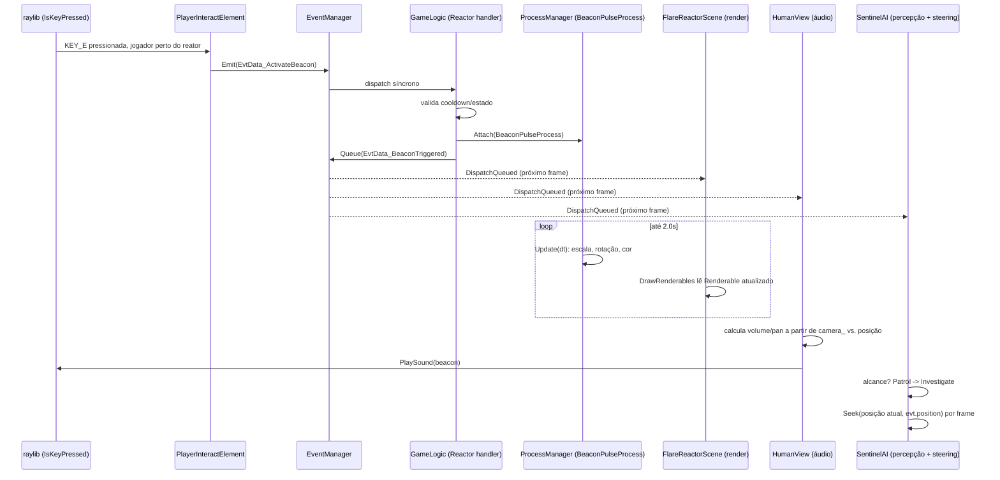

# RFC 1: "O Sinalizador de Alerta" (Flare Reactor) — experimento de integração ponta-a-ponta

- Status: Draft
- Date: 2026-08-06
- Branch alvo sugerida: `claude/flare-reactor-experiment` (a partir de `main`)

## Por que isto é uma RFC, e não uma ADR

`docs/adr/` registra decisões, uma de cada vez, cada uma isolada e (na maioria) já implementada.
Este documento é diferente: é um plano de execução para um experimento que atravessa *todos* os
sistemas já decididos em `.claude/skills/engine-architecture` num único caminho real e observável —
`InputManager → Evento → GameLogic → ProcessManager → Render → Áudio → IA`. Não é uma escolha
entre opções (o formato ADR), é um roteiro passo a passo, com um design proposto por etapa, aberto
a comentário antes de virar uma sequência de PRs. Cada peça nova que este documento propõe que
"vire real" (um novo componente ECS, uma nova `Process`, um novo evento) deve, quando implementada,
ganhar sua própria ADR pequena ou pelo menos uma entrada no `docs/roadmap.md` — esta RFC é o mapa,
não o registro de decisão de cada parada.

## Resumo

Um cenário minúsculo — três entidades, sem condição de vitória/derrota — construído
especificamente para provar, de ponta a ponta, que os sistemas descritos em
`engine-architecture` (event manager, process manager, ECS via EnTT, resource cache,
entity/level loading, `BaseGameLogic`/`IGameView`, pilha de `IScreenElement`) conseguem colaborar
num único momento de jogo real, e para expor exatamente onde a costura ainda não existe (IA,
áudio posicional, input rebindável). É um "hello world" da pilha inteira, não um jogo.

## Motivação

Cada sistema em `engine-architecture` já foi provado isoladamente: testes unitários, ou um único
consumidor real estreito (`"Position"` → `LocalTransform`/`WorldTransform`, a `GameplayScene`, o
`GameplayHud`). Nenhum cenário real ainda encadeia **todos** eles no mesmo frame: um input causa
um evento, que uma `GameLogic` valida, que dispara um `Process` multi-frame, que dois sistemas
completamente desacoplados (render e áudio) observam, que um terceiro sistema desacoplado (IA)
também observa e reage com um comportamento próprio (FSM + steering). Este é exatamente o tipo de
"segundo/terceiro consumidor real" que este projeto já usa repetidamente (ADR-0015/0016/0017)
para decidir o que generalizar — só que aplicado à pilha inteira de uma vez, não a um sistema por
vez.

## Não-objetivos

- **Não é um jogo jogável.** Sem menu, sem condição de vitória/derrota, sem progressão.
- **Não resolve pathfinding.** Só steering (Seek), por `engine-ai-behavior` §5 — não há geometria
  de nível para um grid/navmesh navegar ainda.
- **Não constrói física real.** ADR-0012 (`IGamePhysics`) continua `Proposed`, intocada. A
  detecção "jogador perto do reator" é uma checagem de distância simples
  (`Vector3Distance`), não colisão.
- **Não constrói o sistema de key-binding completo.** ADR-0013 continua `Proposed`. A tecla `E` é
  lida diretamente, como o `HumanView` de hoje já faz para as setas — ver Questão em Aberto
  abaixo sobre quando isso deixa de ser sustentável.
- **Não implementa áudio 3D real.** raylib não tem uma API de áudio posicional
  (`vendor/raylib/src/raylib.h` só expõe `SetSoundVolume`/`SetSoundPitch`/`SetSoundPan` — sem
  equivalente a um `PlaySound3D`). O efeito é aproximado por atenuação de volume + pan estéreo,
  calculado uma vez no momento do disparo. Ver §5 abaixo — isto corrige uma imprecisão do
  cenário original (`PlaySoundSound3D` não existe na API real do raylib).
- **Não usa NavMesh/A\*.**

## Cenário

Três entidades, carregadas via `EntityFactory`/`LevelLoader` (ADR-0008/0009) a partir de um novo
`assets/levels/flare_reactor.yaml`, exatamente como `level_01.yaml` já faz hoje:

| Entidade | Componentes (novos em **negrito**) |
|---|---|
| Jogador | `Position` → `LocalTransform`/`WorldTransform`, **`PlayerTag`**, **`Renderable`** (caixa) |
| Reator | `Position`, **`ReactorTag`**, **`Reactor`** (cooldown/estado), **`Renderable`** (caixa cinza) |
| Sentinela (NPC) | `Position`, **`SentinelAI`** (FSM + steering), **`Patrol`** (waypoints), **`Renderable`** (esfera) |

`PlayerTag`/`ReactorTag` resolvem de propósito um ponto cego que já existe hoje em
`game/sandbox/screen_gameplay.cpp` ("primeira entidade no registry é o jogador, até existir mais
de uma entidade" — comentário já presente no código): com três entidades reais, essa heurística
quebra, e uma tag explícita é a correção óbvia — pequena, mas incidental a este experimento, não o
seu objetivo.

## Desenho, sistema por sistema

### 1. Captação de input

**Hoje**: `HumanView::VOnUpdate` (`game/sandbox/human_view.cpp`) já lê `IsKeyDown` diretamente,
sem nenhuma camada de tradução — decisão explícita do ADR-0010 (raylib já entrega input por
polling, não há fila de mensagens Win32 para traduzir). **Proposto**: mesmo padrão, uma linha a
mais — `IsKeyPressed(KEY_E)` (borda de subida, não nível, porque interagir é uma ação
discreta, não contínua como mover). Nenhum `ACTION_INTERACT` abstrato ainda — ver Questão em
Aberto sobre ADR-0013.

### 2. Intent → Evento

Dois tipos de evento novos, específicos deste jogo (`src/game/flare_reactor/events.h` — eventos de
domínio ficam no módulo do jogo, não em `app/`, mesma fronteira do ADR-0014):

```cpp
struct EvtData_ActivateBeacon { entt::entity actorId; };
struct EvtData_BeaconTriggered { entt::entity reactorId; Vector3 position; };
```

Uma `PlayerInteractElement` (novo `IScreenElement`, ao lado de `GameplayScene`/`GameplayHud`)
lê a tecla em `VOnUpdate` e, se o jogador estiver a menos de `kInteractRadius` do reator
(`Vector3Distance`, sem física real — não-objetivo já listado), chama
`events_.Emit(EvtData_ActivateBeacon{playerActor})`. `Emit` (síncrono), não `Queue`, porque este é
o disparo de origem — nada mais está no meio de despachar este mesmo tipo de evento neste
instante.

### 3. `EventManager` — nenhum código novo

`Subscribe`/`Emit`/`Queue`/`DispatchQueued` (`app/event_manager.h`, ADR-0003/0005) já bastam. Uso
proposto: `EvtData_ActivateBeacon` via `Emit` (hop único, síncrono); o broadcast de saída da
`GameLogic`, `EvtData_BeaconTriggered`, via `Queue` — não estritamente necessário hoje (nenhum dos
três assinantes plancjados re-emite o mesmo tipo), mas é a mesma proteção contra reentrância que
ADR-0005 já desenhou para exatamente este formato de "um evento com vários assinantes
desacoplados"; custa uma chamada, evita uma categoria de bug se um assinante futuro reagir emitindo
outro evento do mesmo tipo.

### 4. GameLogic — validação e estado

Novo componente ECS (dado puro, não uma classe de sistema):

```cpp
struct Reactor {
    float cooldownRemaining = 0.0f;
    bool active = false;
};
```

Um assinante — registrado uma vez, no setup do módulo do jogo, ao lado de
`RegisterComponentLoaders` (mesmo lugar/padrão já usado em `screen_gameplay.cpp`) — resolve a
única entidade com `ReactorTag` e valida:

```cpp
events_.Subscribe<EvtData_ActivateBeacon>([&registry](const EvtData_ActivateBeacon &) {
    auto reactorView = registry.view<ReactorTag, Reactor, LocalTransform>();
    for (auto entity : reactorView) {
        auto &reactor = reactorView.get<Reactor>(entity);
        if (reactor.active || reactor.cooldownRemaining > 0.0f) return;  // inválido, ignora

        reactor.active = true;
        reactor.cooldownRemaining = kReactorCooldownSeconds;
        events_.Queue(EvtData_BeaconTriggered{entity, reactorView.get<LocalTransform>(entity).position});
    }
});
```

Dado puro (`Reactor`) + uma lambda livre — não uma nova "classe de subsistema de GameLogic". Ver
Questão em Aberto sobre onde exatamente esse `Subscribe` deveria morar (`BaseGameLogic` em si, ou
um arquivo de setup do jogo).

### 5. `ProcessManager` — `BeaconPulseProcess`

```cpp
class BeaconPulseProcess : public Process {
public:
    BeaconPulseProcess(entt::registry &registry, entt::entity reactor)
        : registry_(registry), reactor_(reactor) {}

    void Update(float dt) override {
        elapsed_ += dt;
        float t = std::min(elapsed_ / kDurationSeconds, 1.0f);

        auto &local = registry_.get<LocalTransform>(reactor_);
        local.scale = Vector3Lerp(kBaseScale, kPulsedScale, EaseOutQuad(t));   // expansão ease-out
        local.rotation = QuaternionFromAxisAngle(Vector3{0, 1, 0}, elapsed_ * kSpinSpeed);

        auto &renderable = registry_.get<Renderable>(reactor_);
        renderable.color = ColorLerp(GRAY, RED, t);

        if (t >= 1.0f) Succeed();
    }

private:
    entt::registry &registry_;
    entt::entity reactor_;
    float elapsed_ = 0.0f;
};
```

Atrelado ao `entt::entity`, não a um "ator" com campos próprios — é exatamente o caso que
`engine-architecture` §2 descreve (comportamento multi-frame que não é dono de seu próprio
estado; aqui a entidade ECS não tem *nenhum* estado próprio fora de componentes, então o `Process`
é o lugar natural para a animação, não um adendo). Anexado via `processes_.Attach(...)` dentro do
mesmo handler do passo 4, logo após validar. Ao contrário do GCC4 original (que o cenário-fonte
cita com `OnSuccess()`), `Process` neste projeto não tem esse hook — o próprio `Update` faz o
trabalho de "ao terminar" inline antes de chamar `Succeed()` (ver `app/process.h`); não há
callback separado a implementar.

Note a separação deliberada: o passo 4 (`GameLogic`) decide *se* a ativação é válida e vira o
estado lógico (`Reactor::active`); o `Process` anima *como isso aparece* (escala, cor, rotação).
Mesmo split Logic/View que o resto do projeto já aplica, só que dentro de uma única `Process` em
vez de entre `BaseGameLogic`/`IGameView`.

### 6. Render

**Hoje não existe nenhum componente de render além de `LocalTransform`/`WorldTransform`** —
`GameplayScene` (`game/sandbox/human_view.cpp`) desenha um `DrawCubeWires` 1×1×1 cor MAROON
hardcoded por entidade, sem ler nenhum dado de aparência. Este experimento precisa de verdade de
cor e forma por entidade (caixa cinza→vermelha para o reator, esfera para a sentinela), então
propõe o primeiro componente de render real do projeto:

```cpp
struct Renderable {
    enum class Shape { Box, Sphere } shape = Shape::Box;
    Vector3 size{1.0f, 1.0f, 1.0f};
    Color color = GRAY;
    bool wireframe = true;
};

void DrawRenderables(entt::registry &registry);  // itera WorldTransform + Renderable
```

Proposto em `app/renderable.h` (game-agnostic), não em `src/game/flare_reactor/` — é
genuinamente reutilizável por `game/sandbox` no dia em que sua `GameplayScene` quiser parar de
hardcodar `DrawCubeWires`. (Nota lateral: uma preocupação equivalente — duplicar
`DrawBoxRenderables` por jogo — já foi registrada de forma independente num rascunho de ADR-0018
ainda não mesclado à `main`, na branch `claude/camera-fps-second-game-module`; se aquela branch for
mesclada primeiro, este `Renderable` deveria convergir com o que ela já tiver, não coexistir como
uma segunda forma do mesmo componente.)

`FlareReactorScene` (novo `IScreenElement`, mesmo papel de `GameplayScene`) chama
`DrawRenderables(registry_)` dentro do seu `BeginMode3D`/`EndMode3D`, em vez de hardcodar a
geometria.

### 7. Áudio

**Correção em relação ao cenário original**: raylib não expõe áudio 3D/posicional
(`PlaySound3D`/`PlaySoundSound3D` não existem — conferido em
`vendor/raylib/src/raylib.h:1684-1691`). O que existe: `PlaySound`, `SetSoundVolume`,
`SetSoundPitch`, `SetSoundPan` (mono pan -1..1). O efeito "3D" é aproximado, calculado uma vez no
momento do gatilho, a partir da posição da câmera (`HumanView::camera_`) e da posição do evento:

```cpp
// No handler de EvtData_BeaconTriggered, dentro de HumanView (que já guarda camera_ e sounds_):
Vector3 toSound = Vector3Subtract(evt.position, camera_.target);
float distance = Vector3Length(toSound);
float volume = Clamp(1.0f - distance / kMaxAudibleDistance, 0.0f, 1.0f);
Vector3 right = Vector3CrossProduct(Vector3Subtract(camera_.target, camera_.position), camera_.up);
float pan = Clamp(0.5f + Vector3DotProduct(Vector3Normalize(toSound), Vector3Normalize(right)) * 0.5f, 0.0f, 1.0f);

Sound beacon = *sounds_.GetHandle("resources/sound/beacon.wav");   // ResourceCache<Sound>, ADR-0004
SetSoundVolume(beacon, volume);
SetSoundPan(beacon, pan);
PlaySound(beacon);
```

Isso exige que `HumanView` passe a assinar `EvtData_BeaconTriggered` — hoje `HumanView` não guarda
uma referência a `EventManager` (só `registry_`/`processes_`/`sounds_`); este é um novo parâmetro
de construtor, mesmo padrão incremental já usado quando `processes_`/`sounds_` foram adicionados.

### 8. IA — percepção, FSM, steering

Via `engine-ai-behavior` diretamente, primeiro uso real do skill neste projeto:

```cpp
enum class SentinelState { Patrol, Investigate };

struct SentinelAI {
    SentinelState state = SentinelState::Patrol;
    Vector3 velocity{0, 0, 0};
    Vector3 investigateTarget{0, 0, 0};
};

struct Patrol {
    std::vector<Vector3> waypoints;
    std::size_t current = 0;
};
```

**Percepção** (§4 do skill — "não deixe a IA trapacear"): a assinatura a
`EvtData_BeaconTriggered` é um broadcast (todo o mapa "ouve" o evento), mas a *reação* ainda é
condicionada por uma checagem de alcance no lado do assinante, não pelo emissor:

```cpp
events_.Subscribe<EvtData_BeaconTriggered>([&registry](const EvtData_BeaconTriggered &evt) {
    for (auto entity : registry.view<SentinelAI, LocalTransform>()) {
        auto &ai = registry.get<SentinelAI>(entity);
        auto &transform = registry.get<LocalTransform>(entity);
        if (Vector3Distance(transform.position, evt.position) > kHearingRadius) continue;

        ai.state = SentinelState::Investigate;
        ai.investigateTarget = evt.position;
    }
});
```

Isto ainda é "onisciência sensorial" no sentido de que o evento carrega a posição exata sem
oclusão/linha-de-visão — aceitável para "ouvir um alarme" (um som se propaga, não precisa de
linha de visão), diferente de "ver o jogador", que exigiria o raycast do skill §4. Vale nomear
essa distinção explicitamente no código quando implementado.

**FSM + steering** (§§1/3 do skill), tickado por frame — ver Questão em Aberto sobre *onde*:

```cpp
void UpdateSentinel(entt::registry &registry, float dt) {
    for (auto entity : registry.view<SentinelAI, Patrol, LocalTransform>()) {
        auto &ai = registry.get<SentinelAI>(entity);
        auto &transform = registry.get<LocalTransform>(entity);
        Vector3 target = (ai.state == SentinelState::Patrol)
            ? registry.get<Patrol>(entity).waypoints[registry.get<Patrol>(entity).current]
            : ai.investigateTarget;

        Vector3 desired = Seek(transform.position, target, kMaxSpeed, kArriveRadius);  // skill §3
        Vector3 accel = Vector3Subtract(desired, ai.velocity);
        if (Vector3Length(accel) > kMaxAccel) accel = Vector3Scale(Vector3Normalize(accel), kMaxAccel);
        ai.velocity = Vector3Add(ai.velocity, Vector3Scale(accel, dt));
        transform.position = Vector3Add(transform.position, Vector3Scale(ai.velocity, dt));

        if (Vector3Distance(transform.position, target) < kArriveRadius) {
            if (ai.state == SentinelState::Patrol) AdvanceWaypoint(registry, entity);
            // Investigate: fica parada no alvo -- sem um terceiro estado "voltar à patrulha" ainda.
        }
    }
}
```

Dois estados (`Patrol`/`Investigate`) tecnicamente caberiam num único `bool investigating` — o
skill (§1) só recomenda uma FSM explícita a partir de 3 estados. Mantido como `enum class` aqui de
propósito: o objetivo desta RFC é provar a forma FSM+percepção+steering deliberadamente, não
minimizar linhas de código de um único NPC.

## Diagrama de sequência



## Novidades por sistema (resumo)

| Sistema | Existe hoje em `main`? | Novo nesta RFC |
|---|---|---|
| Input polling | Sim (`HumanView::VOnUpdate`, setas) | `PlayerInteractElement`, `IsKeyPressed(KEY_E)` |
| `EventManager` | Sim, completo | `EvtData_ActivateBeacon`, `EvtData_BeaconTriggered` |
| Componente `Reactor`/tags | Não | `Reactor`, `ReactorTag`, `PlayerTag` |
| `ProcessManager` | Sim, completo, sem consumidor real | `BeaconPulseProcess` |
| Render por dado | Não (hardcoded `DrawCubeWires`) | `Renderable` (app/), `DrawRenderables` |
| Áudio | Sim (`ResourceCache<Sound>`, `PlaySound`) | cálculo de pan/volume por distância |
| IA | Nenhuma (projeto não tem IA nenhuma ainda) | `SentinelAI`, `Patrol`, `UpdateSentinel`, percepção via evento |
| Módulo de jogo | `sandbox`, `camera_fps` (branch separada) | `src/game/flare_reactor/` (novo, terceiro) |

## Fases propostas (uma PR por fase, cada uma demonstrável sozinha)

1. **Esqueleto**: módulo `flare_reactor`, `flare_reactor.yaml`, `PlayerTag`/`ReactorTag`,
   `Renderable`/`DrawRenderables` em `app/`. Sem interação ainda — só prova que três entidades com
   formas/cores distintas renderizam a partir de dados.
2. **Evento + validação**: `PlayerInteractElement`, `EvtData_ActivateBeacon`/`BeaconTriggered`,
   handler de `GameLogic` com cooldown. Sem efeito visual/sonoro ainda — um `TraceLog` prova o
   fluxo.
3. **`ProcessManager`**: `BeaconPulseProcess` ligado ao passo 2 — primeiro payoff visual real.
4. **Áudio**: assinatura em `HumanView`, cálculo de pan/volume.
5. **IA**: `SentinelAI`/`Patrol`, percepção via evento, `Seek`. Fase mais isolada — pode ser
   desenvolvida em paralelo às fases 2-4 uma vez que a fase 1 exista, já que só depende de
   `EvtData_BeaconTriggered` existir como tipo (não do handler completo da fase 2 estar
   terminado).

## Questões em aberto

- **Onde mora o `Subscribe` de `GameLogic` (passo 4)?** `BaseGameLogic::VOnUpdate` não é
  `virtual` hoje (`app/base_game_logic.h`) — só `VLoadLevel` é. Não há um hook de "tick de
  gameplay específico do jogo" para uma futura `FlareReactorGameLogic : BaseGameLogic` sobrescrever.
  Duas saídas: (a) registrar o `Subscribe`/tickar `UpdateSentinel` diretamente do
  `UpdateGameplayScreen`-equivalente do novo módulo (mesmo lugar onde `HumanView`'s movimento do
  jogador já roda hoje — não é um padrão novo, é o mesmo ponto cego já existente); (b) tornar
  `VOnUpdate` virtual/acrescentar um hook protegido. **Recomendação**: (a) por agora — não mexer
  em `BaseGameLogic` por um único consumidor; revisitar (b) só se um terceiro jogo precisar do
  mesmo hook (mesma disciplina do ADR-0015).
- **ADR-0013 (input binding) vale a pena construir agora?** Esta RFC adiciona uma segunda tecla
  discreta (`E`) além das quatro de movimento já hardcoded. Ainda não é o "segundo consumidor
  real" que justificaria ADR-0013 por si só (mesmo módulo, mesmo `HumanView`) — mas se este
  experimento crescer (mais ações, um segundo jogo com bindings diferentes), é o gatilho natural.
  Não decidido aqui.
- **`Renderable` deveria esperar a branch `claude/camera-fps-second-game-module` mesclar
  primeiro?** Aquela branch já tem uma preocupação de design equivalente registrada (rascunho de
  ADR-0018, `BoxRenderable`/`SceneIndex`). Construir `Renderable` nesta RFC sem coordenar arrisca
  duas formas do mesmo componente competindo depois. Recomendação: checar o estado daquela branch
  antes de começar a Fase 1.
- **Áudio deveria recalcular pan/volume continuamente enquanto o som toca (2s), não só no
  disparo?** Para um pulso curto, calcular uma vez é razoável; se a duração crescer ou a câmera se
  mover muito durante o som, isso fica perceptível. Não decidido — medir antes de complicar.
- **Sentinela "esfriando" de volta a `Patrol` depois de investigar** — nenhum terceiro estado
  (`Cooldown`/`Return`) desenhado aqui. Deixar como pendência explícita se a Fase 5 avançar.

## Referências

- `.claude/skills/engine-architecture` — §§1, 2, 3, 6, 7, 9, 10 (event manager, process manager,
  ECS/prototipagem, entity/level loading, `BaseGameLogic`/`IGameView`, pilha de `IScreenElement`).
- `.claude/skills/engine-ai-behavior` — §§1, 3, 4 (FSM, steering, percepção) — primeiro consumidor
  real proposto para este skill.
- [ADR-0003](../adr/0003-event-manager-and-process-manager-game-loop.md),
  [ADR-0005](../adr/0005-event-manager-queued-dispatch-idata-lua-proposal.md) — `EventManager`/
  `ProcessManager` tal como existem hoje.
- [ADR-0004](../adr/0004-resource-cache-thin-vs-full-book-rescache.md) — `ResourceCache<Sound>`,
  usado no passo 7.
- [ADR-0008](../adr/0008-data-driven-entity-loading-yaml.md),
  [ADR-0009](../adr/0009-level-loading-actor-placement.md) — `EntityFactory`/`LevelLoader`, base do
  cenário.
- [ADR-0010](../adr/0010-base-game-logic-and-igameview.md),
  [ADR-0016](../adr/0016-screen-element-stack.md) — `BaseGameLogic`/`IGameView`/`IScreenElement`,
  base da estrutura do novo módulo.
- [ADR-0012](../adr/0012-physics-thin-raylib-collision-layer.md),
  [ADR-0013](../adr/0013-input-key-binding-system.md) — ambas `Proposed`, deliberadamente não
  usadas por esta RFC (ver Não-objetivos).
- [ADR-0014](../adr/0014-game-module-boundary-and-template-migration.md) — fronteira `app/` vs.
  `src/game/<id>/`, usada para decidir onde cada peça nova mora.
- `vendor/raylib/src/raylib.h:1668-1691` — API real de áudio do raylib, base da correção no passo 7.
- `docs/roadmap.md` — este experimento não substitui nenhuma entrada existente; se aceito, deveria
  ganhar sua própria entrada em "Not started" ou "Proposed", apontando para esta RFC.
